<div align="center">


<br><br>

<a href="https://soham0777.github.io/AquaSentinel/#videos">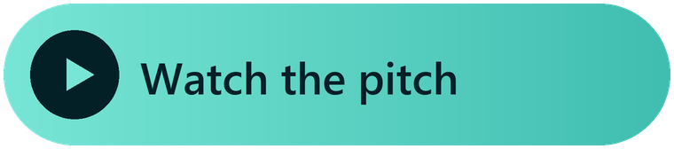</a>
<a href="https://soham0777.github.io/AquaSentinel/viewer.html">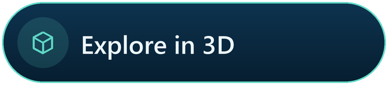</a>
<a href="docs/presentation/AquaSentinel_FDC_AAKRUTI_2026.pdf">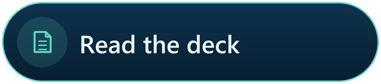</a>
<a href="https://soham0777.github.io/AquaSentinel/">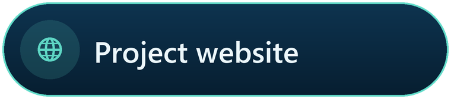</a>

<br>


[](LICENSE)

</div>

<br>

<p align="center">
<b>AquaSentinel</b> is a solar-powered float that rides a stainless guide pole clamped to a bridge pier.<br>
Every 15 minutes it reads the river. When a spill passes, it decides on the float itself, turns its beacon red<br>
for the people at the ghat, alerts the water-works, and <b>seals a time-stamped water sample</b> for a certified lab.<br>
<sub>The river moves it, not a motor.</sub>
</p>

<br>

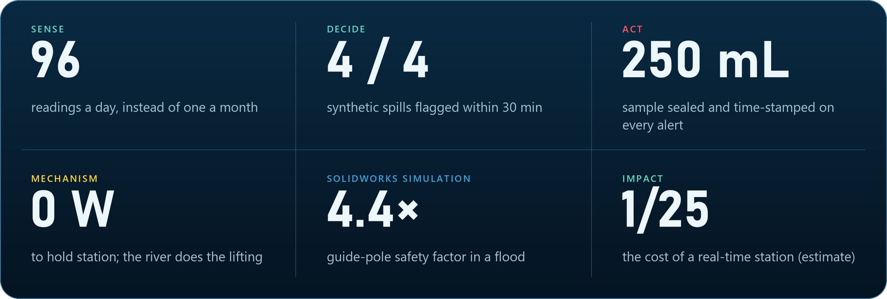

<br>

## The problem

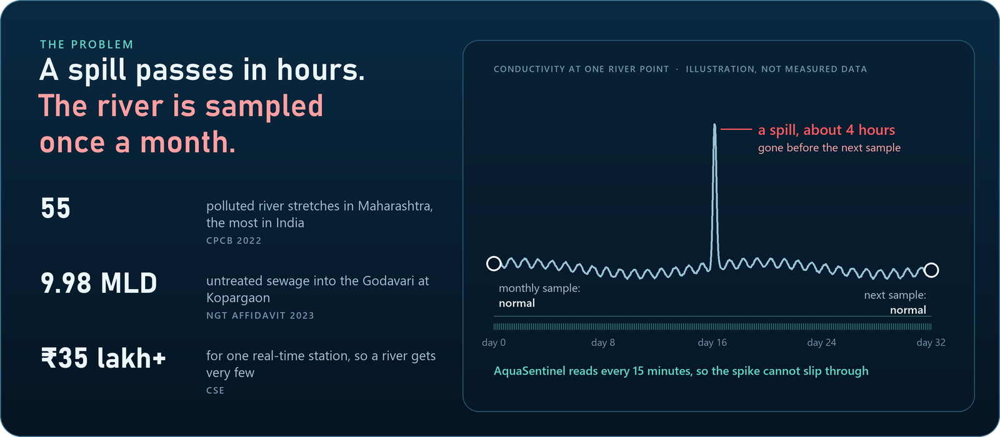

Real-time stations exist, but at ₹35 lakh+ each a river gets very few, and nothing on the market combines
**continuous monitoring, low cost and proof**. AquaSentinel is built for the Godavari at Kopargaon, and for every river like it.

## How it works

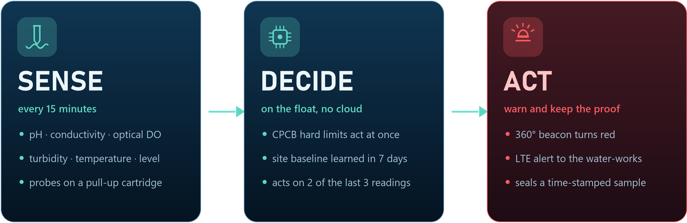

<br>

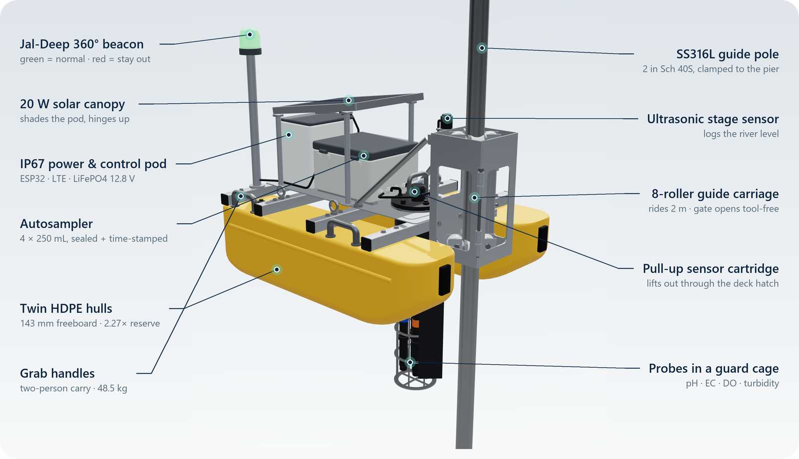

<table>
<tr>
<td width="50%"></td>
<td width="50%"></td>
</tr>
<tr>
<td><b>A float on a pole, not a boat.</b> Eight concave rollers let it ride 2 m of river level. The pole sits at the bow, so the current turns it like a weathervane and the pole carries no torque.</td>
<td><b>66 parts, every one with a reason.</b> The carriage gate opens on two T-handle pins, so the float comes off before a flood without tools. The sensor cartridge lifts out through a deck hatch.</td>
</tr>
</table>

## Gallery

<table>
<tr>
<td width="33%"></td>
<td width="33%"></td>
<td width="33%"></td>
</tr>
<tr>
<td align="center"><sub>Clamped to a bridge pier</sub></td>
<td align="center"><sub>Alert: beacon red, bottle fills</sub></td>
<td align="center"><sub>Exploded, every part numbered</sub></td>
</tr>
<tr>
<td></td>
<td></td>
<td></td>
</tr>
<tr>
<td align="center"><sub>Gate open: the float comes off the pole</sub></td>
<td align="center"><sub>Probes in a guarded well</sub></td>
<td align="center"><sub>Trails the current like a vane</sub></td>
</tr>
</table>


## Engineering

| | Value | How we know |
|---|---|---|
| Size · mass | 1.0 × 0.8 × 0.9 m · **48.5 kg** | CAD mass properties ([design_checks.json](mechanical/checks/design_checks.json)) |
| Freeboard · reserve buoyancy | **143 mm** · **2.27×** | hand calcs on the CAD geometry |
| Stability | GM<sub>T</sub> **0.55 m**, rights itself to **60°** | hand calcs on the CAD geometry |
| Guide pole, flood + debris | **38.3 MPa**, safety factor **4.4**, **1.3 mm** sway | SOLIDWORKS Simulation (pinned hand calc: 54.8 MPa, SF 3.1) |
| Pier bracket | 3.7 MPa, safety factor 46 | SOLIDWORKS Simulation |
| Carriage jamming | **8.6×** margin, 1.7× even with seized rollers | hand calcs |
| Clashes over the full 2 m travel | **0** | voxel interference on the real meshes, 101 part pairs |
| Spill detection | **4 / 4** flagged, each within **30 min** | decision logic on 30 days of **synthetic** river data |
| Cost | **≈ ₹1.34 lakh** prototype vs ₹35 lakh+ per station | catalogue prices ([cost BOM](hardware/AquaSentinel_Cost_Estimate_BOM.csv)) |

> [!IMPORTANT]
> These are **design-stage estimates**: AquaSentinel has **not been tested in water yet**, and the tank test is next.
> Catalogue masses still need weighing, and the 2 m stage range, 1.5 m/s current and 500 N debris load are assumptions
> to confirm at the site. Every claim is traced in the [claims register](docs/engineering/claims_register.md).

<table>
<tr>
<td width="25%"></td>
<td width="25%"></td>
<td width="25%"></td>
<td width="25%"></td>
</tr>
<tr><td colspan="4" align="center"><sub>SOLIDWORKS Simulation: guide pole and pier bracket, von Mises stress and displacement. <a href="mechanical/simulation">Full reports →</a></sub></td></tr>
</table>

## Electronics and decision logic

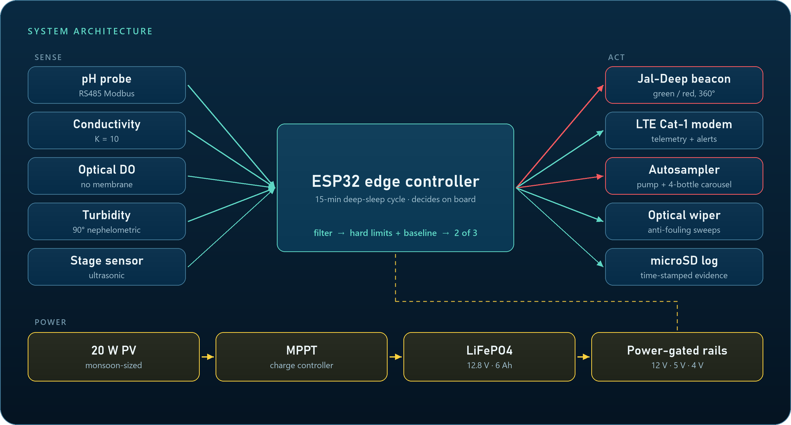

Two tracks run on every reading. **Hard limits act immediately**: anything outside CPCB Class C (pH 6.0–9.0, DO ≥ 4 mg/L,
EC ≤ 2250 µS/cm) is an alert. **A learned baseline catches the rest**: for the first 7 days the float learns what normal
looks like at that site, hour by hour, and then acts when **2 of the last 3** readings are unusual, so a single splash can't
trigger a sample.


<p align="center"><sub>The decision logic replayed on 30 days of synthetic river data with four injected spills: all four flagged, each within 30 minutes. Synthetic benchmark, not field data.</sub></p>

<details>
<summary><b>Firmware modules</b></summary>

<br>

The firmware in [`firmware/edge_node`](firmware/edge_node) is a PlatformIO project (Arduino framework).

| Module | Job |
|---|---|
| `sensor_interface` | power-gated RS485 Modbus reads of the four probes + stage |
| `dsp_filters` | exponential smoothing of each probe before any decision |
| `anomaly_engine` | CPCB Class C hard limits + robust z-score against a 24-bin diurnal baseline |
| `autosampler` | 20 s purge to waste, 30 s fill, carousel indexing; bottle state survives deep sleep |
| `wiper_actuator` | anti-fouling sweeps of the optical faces |
| `microsd_logger` · `telemetry_comm` | time-stamped evidence log; JSON telemetry frame handed to the LTE modem (AT-command driver still to be written) |

Python reference of the decision step: [`analytics/detector.py`](analytics/detector.py) ·
electronics: [KiCad schematic](hardware/kicad), [power budget](hardware/power_budget.csv) (≈ 3.4 Wh/day estimated).
</details>

## Try it

<table>
<tr>
<td width="50%"><a href="https://soham0777.github.io/AquaSentinel/viewer.html">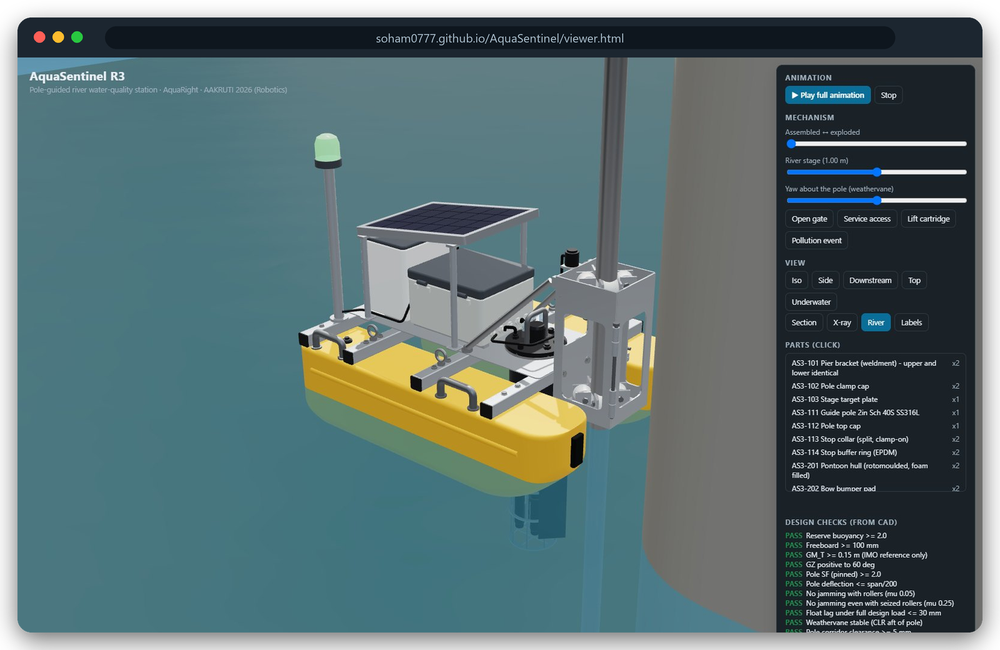</a></td>
<td width="50%"><a href="https://soham0777.github.io/AquaSentinel/dashboard/">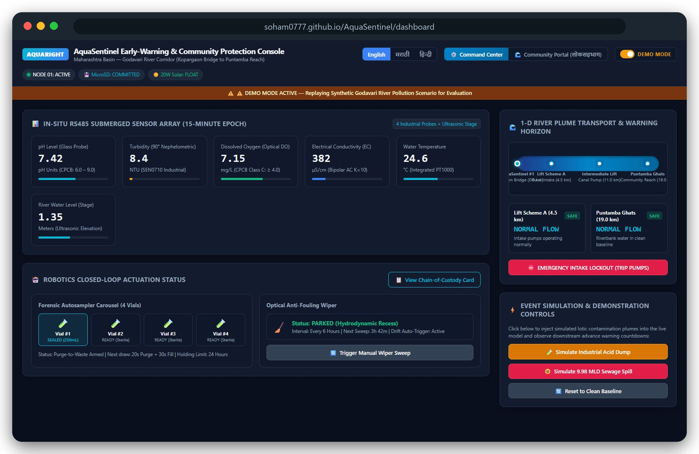</a></td>
</tr>
<tr>
<td><b><a href="https://soham0777.github.io/AquaSentinel/viewer.html">Interactive 3D model →</a></b><br><sub>Raise the river, open the gate, lift the cartridge, trigger a pollution event, explode it, click any part.</sub></td>
<td><b><a href="https://soham0777.github.io/AquaSentinel/dashboard/">Command dashboard →</a></b><br><sub>For the water-works and pollution board, in English, मराठी and हिंदी. Demo mode, synthetic scenario.</sub></td>
</tr>
</table>

## Videos

<table>
<tr>
<td width="33%"><a href="https://soham0777.github.io/AquaSentinel/#videos">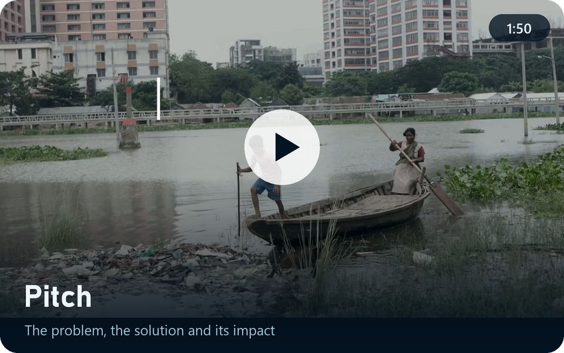</a></td>
<td width="33%"><a href="https://soham0777.github.io/AquaSentinel/#videos">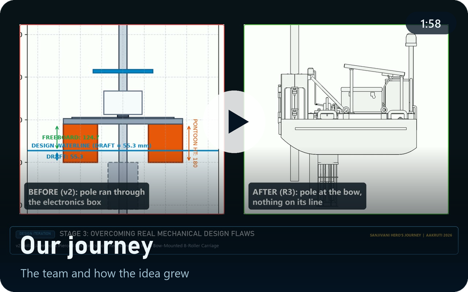</a></td>
<td width="33%"><a href="https://soham0777.github.io/AquaSentinel/#videos">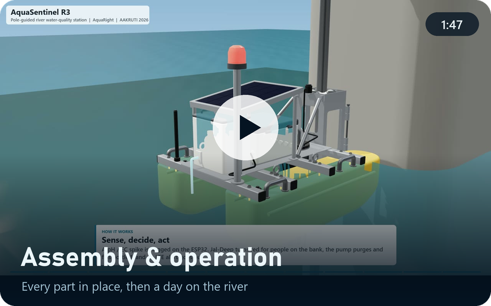</a></td>
</tr>
</table>

<p align="center"><sub>Watch in the browser on the <a href="https://soham0777.github.io/AquaSentinel/#videos">project site</a> · full-quality 1080p files on the <a href="https://github.com/soham0777/AquaSentinel/releases/latest">latest release</a></sub></p>

## The presentation

<a href="docs/presentation/AquaSentinel_FDC_AAKRUTI_2026.pdf"></a>

<p align="center"><sub>The 13-slide Final Design Concept on the official AAKRUTI template · <a href="docs/presentation/AquaSentinel_FDC_AAKRUTI_2026.pdf">PDF</a> · PowerPoint in the <a href="https://github.com/soham0777/AquaSentinel/releases/latest">release</a></sub></p>

## The design journey

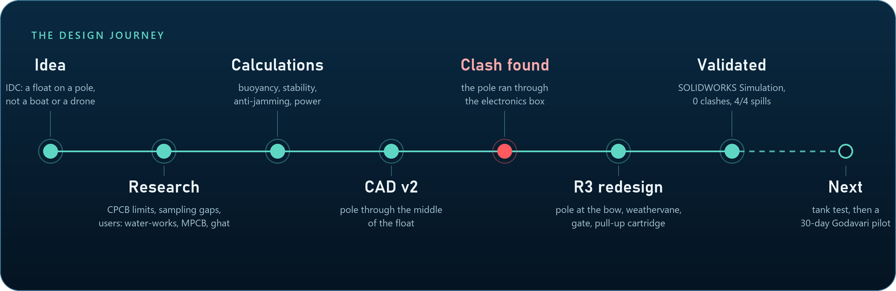

The biggest lesson came from our own CAD: in v2 the guide pole ran straight through the electronics box. Moving the pole
to the bow fixed the clash, and it turned a problem into a feature: the float now weathervanes with the current.

<details>
<summary><b>Planned in ENOVIA</b></summary>
<br>

</details>

## What's in the repository

| | |
|---|---|
| [`mechanical/`](mechanical) | R3 parametric design engine, **SOLIDWORKS Pack and Go**, STEP/STL/GLB, BOM, 6 × A3 drawings, design checks, SOLIDWORKS Simulation |
| [`firmware/`](firmware) | ESP32 edge controller (PlatformIO) |
| [`analytics/`](analytics) | detection engine reference, synthetic benchmark, plume travel-time model |
| [`hardware/`](hardware) | KiCad schematic, power budget, cost estimate, bench test procedure |
| [`docs/`](docs) | the project site: 3D viewer, dashboard, presentation, videos, engineering notes |
| [`project-management/`](project-management) | ENOVIA project plan |

<details>
<summary><b>Run it yourself</b></summary>

```bash
# replay the detection engine on the synthetic dataset (Python 3 + numpy, matplotlib)
cd analytics && python evaluate.py
```

```bash
# rebuild the whole mechanical design: geometry, checks, STEP/STL/GLB, BOM (Python 3 + numpy, matplotlib, Pillow)
cd mechanical && python src/build.py
```

```bash
# build the firmware (PlatformIO; not yet compiled and run on the real hardware)
cd firmware/edge_node && pio run
```

To open the CAD, unzip `mechanical/solidworks/AquaSentinel_R3_SOLIDWORKS_PackAndGo.zip` and open `AquaSentinel_R3_Assembly.SLDASM` in SOLIDWORKS.
</details>

## Status

| Done | Next |
|---|---|
| Complete R3 design: 66 parts, drawings, BOM | Tank test: draft, 2 m travel, roller friction |
| SOLIDWORKS Simulation of the pole and pier bracket | Weigh the real components, update the mass budget |
| Hydrostatics, stability, anti-jamming and clash checks | 30-day Godavari pilot at Kopargaon (permits needed) |
| Firmware architecture and decision logic | Bench-run the firmware on the real probes and modem |
| Decision logic on synthetic data: 4/4 spills flagged | Validate on field data with a certified lab |
| Dashboard demo in three languages | Dated supplier quotes for the cost estimate |

Probes give clues, not lab results: the float flags a likely spill and seals the evidence, and a certified lab confirms it.

## Team

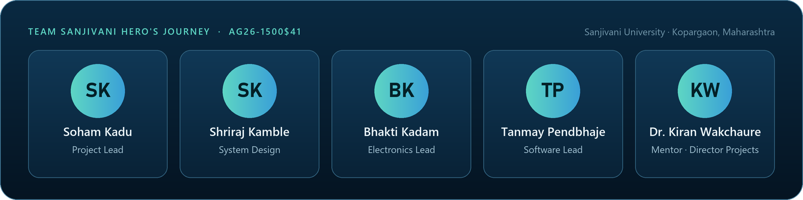

Our Final Design Concept entry for the **AAKRUTI Innovation Competition 2026** (Robotics theme), run with **Dassault Systèmes**
on the 3DEXPERIENCE platform: designed in **SOLIDWORKS**, validated in **SOLIDWORKS Simulation**, planned in **ENOVIA**.

<sub>Code (design engine, firmware, analytics, dashboard, viewer) is released under the [MIT License](LICENSE). The presentation, videos,
renders and drawings are © 2026 Team Sanjivani Hero's Journey; please ask before reusing them.</sub>

<div align="center"><br><sub>Made on the banks of the Godavari 🌊</sub></div>
