<div align="center">

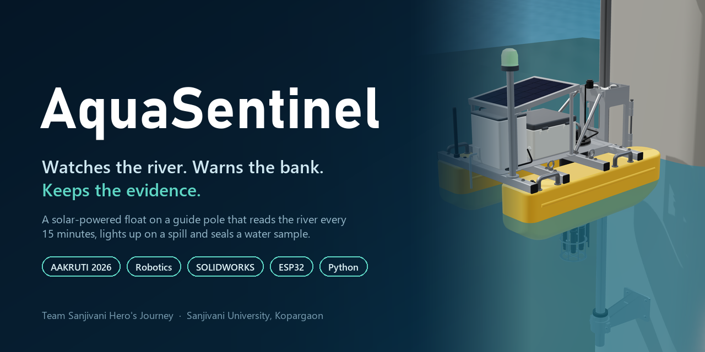

<br>

[](#-the-competition)
[](#-how-it-works)
[](#-honest-status)

[](mechanical/solidworks)
[](firmware/edge_node)
[](mechanical/src)
[](https://soham0777.github.io/AquaSentinel/viewer.html)
[](LICENSE)

### [🌐 Project site](https://soham0777.github.io/AquaSentinel/) &nbsp;·&nbsp; [🧊 Live 3D model](https://soham0777.github.io/AquaSentinel/viewer.html) &nbsp;·&nbsp; [📊 Dashboard demo](https://soham0777.github.io/AquaSentinel/dashboard/) &nbsp;·&nbsp; [📑 Presentation](docs/presentation/AquaSentinel_FDC_AAKRUTI_2026.pdf) &nbsp;·&nbsp; [🎬 Videos](#-videos)

</div>

<br>

**AquaSentinel** is a solar-powered float that rides a stainless guide pole clamped to a bridge pier. Every 15 minutes it
reads the river: pH, conductivity, dissolved oxygen, turbidity, temperature and level. When something unusual passes, it decides
on the float itself, turns its beacon red for the people at the ghat, sends an SMS, and **seals a time-stamped water sample**
for a certified lab. The river moves it, not a motor.

Built by **Team Sanjivani Hero's Journey** (Sanjivani University, Kopargaon) for the **AAKRUTI Innovation Competition 2026**,
organised with Dassault Systèmes. This repository is the complete Final Design Concept: CAD, simulation, firmware, analytics,
dashboard, drawings, presentation and videos.

<br>

## 🌊 The problem

<table>
<tr>
<td width="33%" align="center"><h1>55</h1>polluted river stretches in Maharashtra, the most of any state<br><sub>CPCB, 2022</sub></td>
<td width="33%" align="center"><h1>9.98 MLD</h1>of untreated sewage enters the Godavari at Kopargaon<br><sub>Govt. of Maharashtra affidavit to NGT, 2023</sub></td>
<td width="33%" align="center"><h1>1× / month</h1>river sampling under the national programme, at best<br><sub>CPCB NWMP</sub></td>
</tr>
</table>

A spill can pass in hours. Routine sampling may miss it, so people downstream find out too late, and there is nothing left
to test. Real-time stations exist, but at **₹35 lakh+ each** (CSE analysis of CPCB tenders) a river gets very few of them.
No current option combines **continuous monitoring, low cost and proof**.

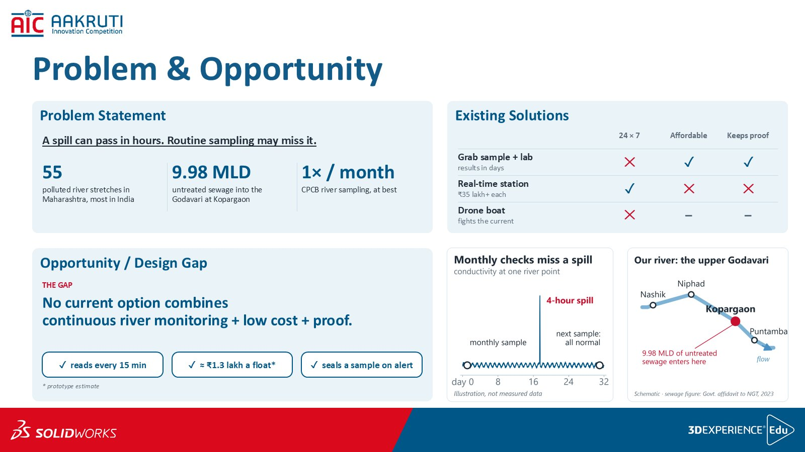

## 💡 What AquaSentinel does

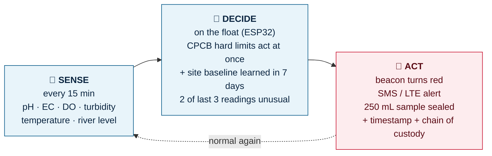
```mermaid
flowchart LR
    S["🔬 <b>SENSE</b><br/>every 15 min<br/>pH · EC · DO · turbidity<br/>temperature · river level"]
    D["🧠 <b>DECIDE</b><br/>on the float (ESP32)<br/>CPCB hard limits act at once<br/>+ site baseline learned in 7 days<br/>2 of last 3 readings unusual"]
    A["🚨 <b>ACT</b><br/>beacon turns red<br/>SMS / LTE alert<br/>250 mL sample sealed<br/>+ timestamp + chain of custody"]
    S --> D --> A
    A -. "normal again" .-> S
    style S fill:#E8F4FA,stroke:#005686,color:#0B2540
    style D fill:#E8F4FA,stroke:#005686,color:#0B2540
    style A fill:#FDECEE,stroke:#C8102E,color:#5A0A14
```

| Who | What they get |
|---|---|
| 🏭 **Water-works** | a warning in time to close the intake |
| 🏛️ **MPCB / pollution board** | a timed, sealed sample to act on |
| 🧺 **People at the ghat** | a light anyone can read: green = normal, red = stay out of the water. No phone, no app. |

## ⚙️ How it works

<table>
<tr>
<td width="55%">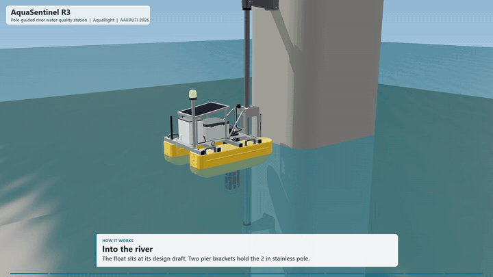</td>
<td>

**A float on a pole, not a boat.**

- A 2 in **SS316L guide pole** is clamped to the bridge pier with two brackets.
- An **8-roller carriage** (concave UHMW-PE rollers, two tiers 350 mm apart) lets the twin-hull float slide up and down **2 m** of travel as the river rises and falls.
- The pole sits at the bow, so the current turns the float like a **weathervane**. The pole carries no torque, and only the rub rails can touch the pier.
- **0 motors, 0 W** to hold station. A 20 W solar canopy shades the electronics pod and feeds a LiFePO4 battery.
- The front half of the carriage is a **gate on a hinge**: two T-handle pins, and the float comes off the pole before a flood, without tools.

</td>
</tr>
</table>

<table>
<tr>
<td width="50%">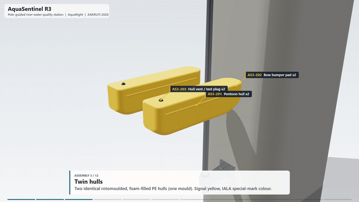<br><sub><b>Assembly sequence</b>: 66 parts, built and checked in CAD</sub></td>
<td width="50%">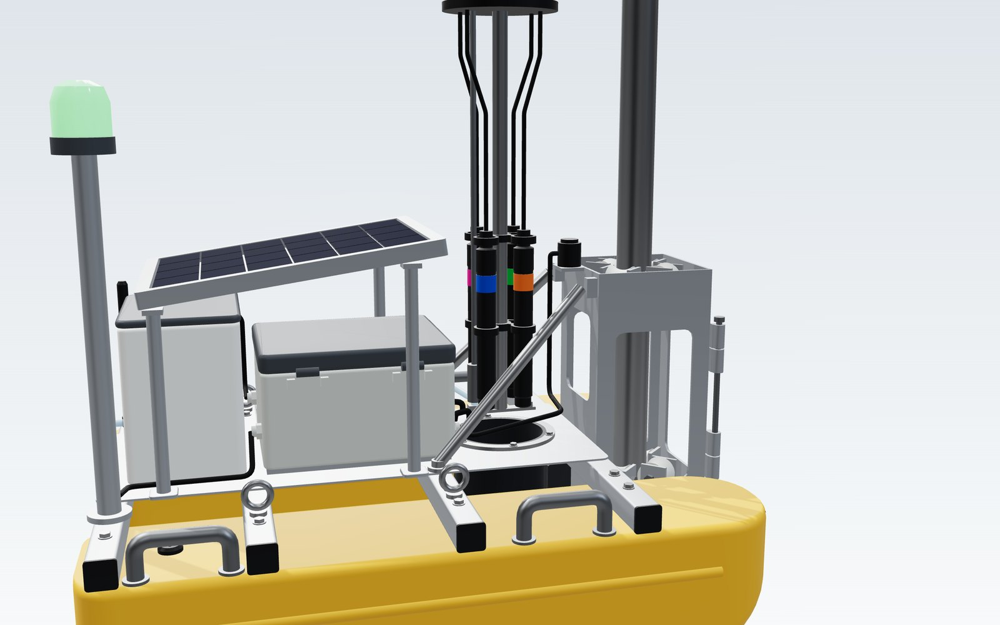<br><sub><b>Pull-up sensor cartridge</b>: four probes, a wiper and the sample intake lift out through a deck hatch for cleaning and calibration, no wading</sub></td>
</tr>
</table>

## 🖼️ Gallery

<table>
<tr>
<td>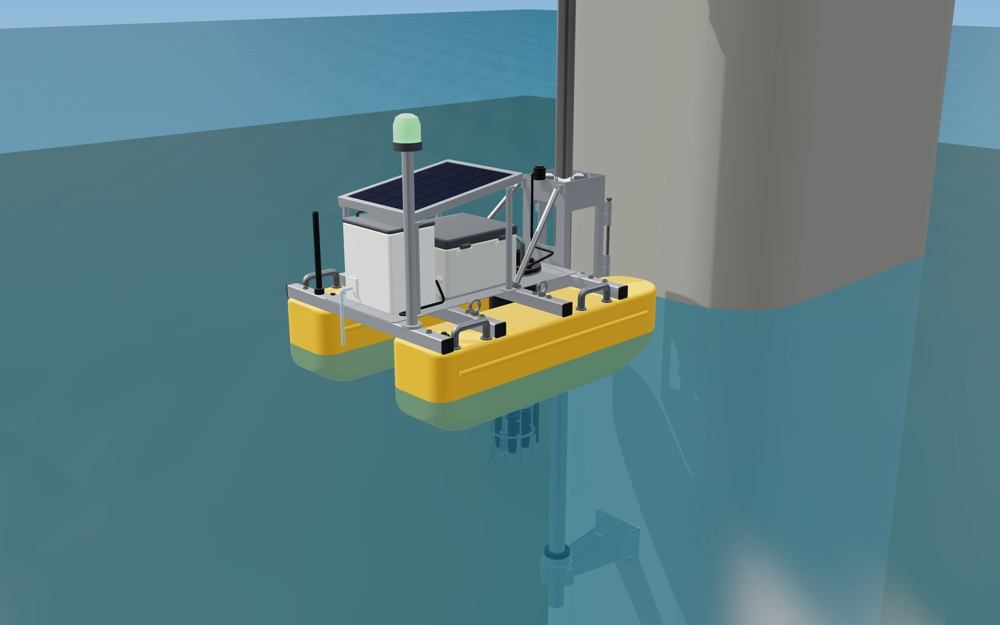<br><sub>Clamped to a bridge pier</sub></td>
<td>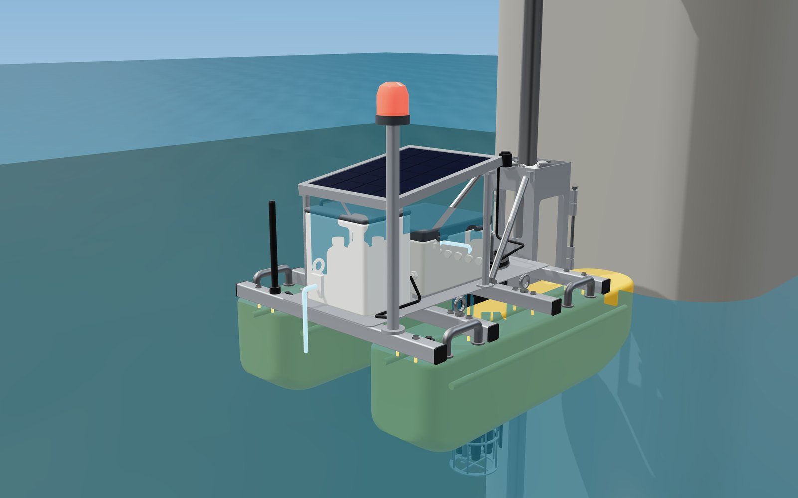<br><sub>Alert: beacon red, bottle fills</sub></td>
<td>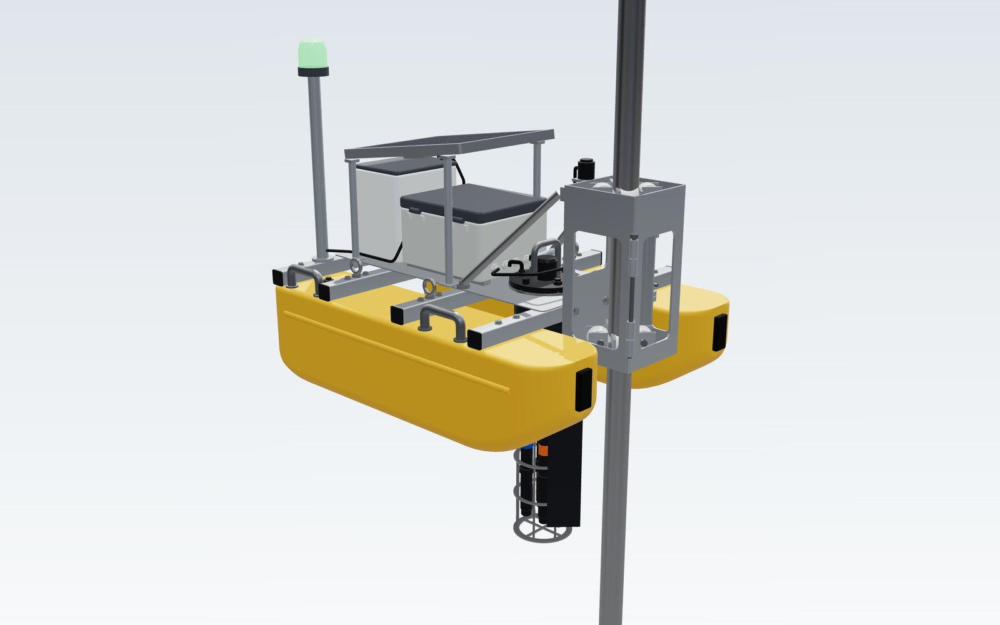<br><sub>Studio view, bow</sub></td>
</tr>
<tr>
<td>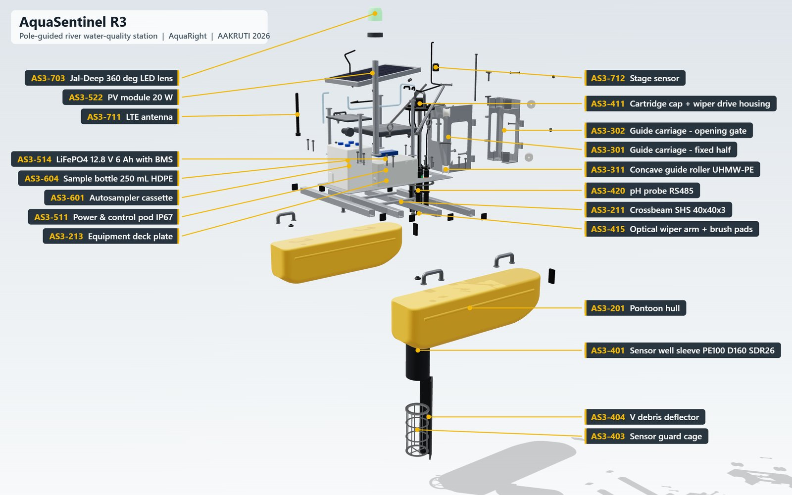<br><sub>Exploded, every part numbered</sub></td>
<td>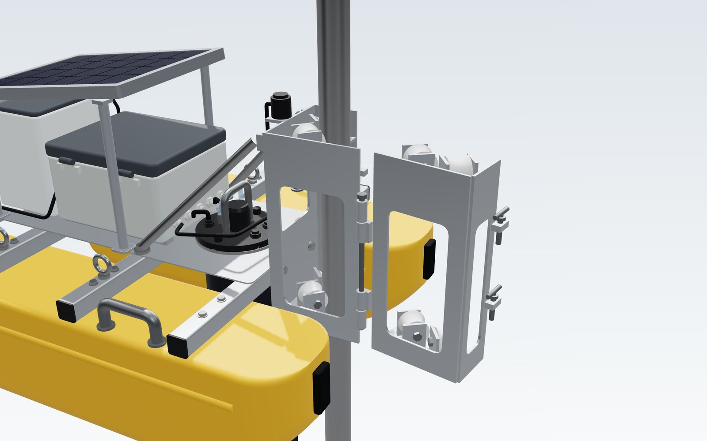<br><sub>Gate open: float off without removing the pole</sub></td>
<td>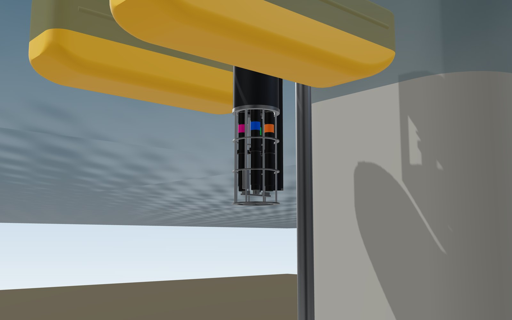<br><sub>Probes in a guarded well between the hulls</sub></td>
</tr>
<tr>
<td>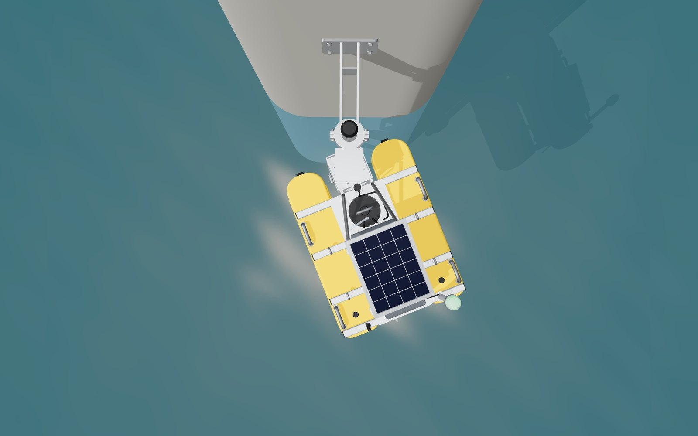<br><sub>Trails the current like a weathervane</sub></td>
<td>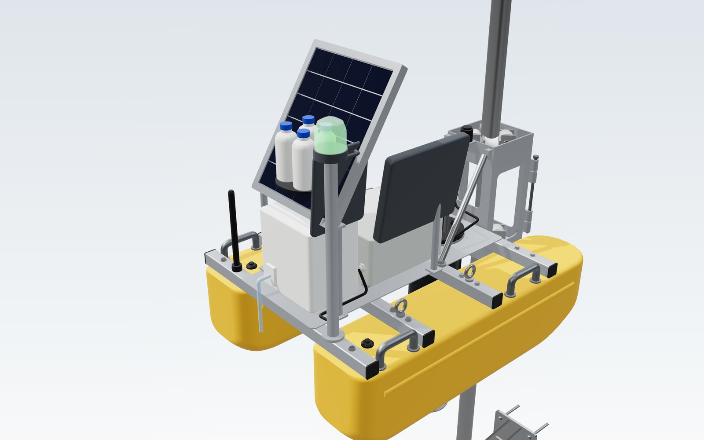<br><sub>Service from the deck</sub></td>
<td>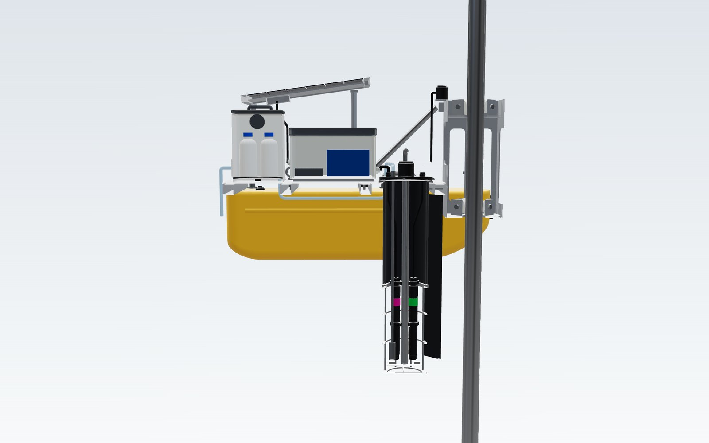<br><sub>Section through the centreline</sub></td>
</tr>
</table>

<p align="center">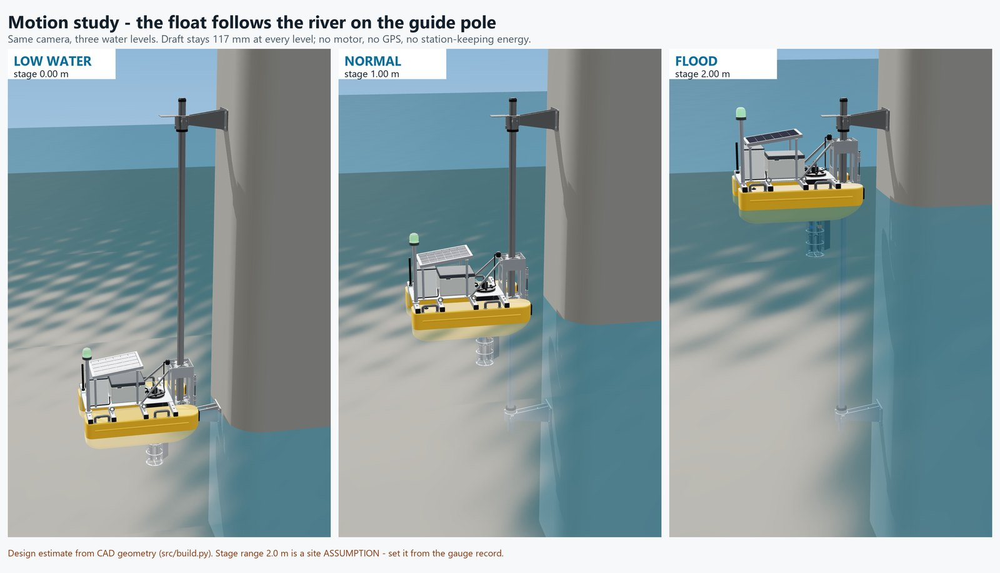<br><sub>Motion study: same camera, three water levels. The draft stays the same at every level.</sub></p>

## 📐 Engineering at a glance

| | Value | How we know |
|---|---|---|
| Size · mass | 1.0 × 0.8 × 0.9 m · **48.5 kg** | CAD mass properties ([design_checks.json](mechanical/checks/design_checks.json)) |
| Parts | **66** unique parts | SOLIDWORKS assembly + [BOM](mechanical/cad/BOM_R3.csv) |
| Freeboard · reserve buoyancy | **143 mm** · **2.27×** | Hand calcs on the CAD geometry |
| Stability | GM<sub>T</sub> **0.55 m**, rights itself to **60°** (GZ max 180 mm at 25°) | Hand calcs on the CAD geometry |
| Guide pole, flood + debris case | **38.3 MPa** peak, safety factor **4.4** (316L yield 170 MPa), **1.3 mm** sway | SOLIDWORKS Simulation, linear static |
| Same pole, conservative pinned hand calc | 54.8 MPa, SF 3.1 | [analysis.py](mechanical/src/analysis.py) |
| Pier bracket | 3.7 MPa peak, safety factor 46 | SOLIDWORKS Simulation |
| Carriage jamming | **8.6×** margin (1.7× even with seized rollers) | Hand calcs |
| Clashes | **0** over the full 2 m travel | Voxel interference on the real meshes, 101 part pairs |
| Detection | **4 / 4** synthetic spill cases flagged, each within **30 min** | Decision logic replayed on 30 days of **synthetic** river data |
| Cost | **≈ ₹1.34 lakh** prototype vs ₹35 lakh+ per real-time station, **≈ 1/25th** | Catalogue prices ([cost BOM](hardware/AquaSentinel_Cost_Estimate_BOM.csv)) |

> [!IMPORTANT]
> These are **design-stage estimates**. AquaSentinel has **not been tested in water yet**; a tank test is next.
> Catalogue masses still need to be replaced with weighed values, and the 2 m stage range, 1.5 m/s current and 500 N debris load
> are design assumptions to be confirmed at the site. See [`docs/engineering/claims_register.md`](docs/engineering/claims_register.md).

### Design validation in SOLIDWORKS Simulation

<table>
<tr>
<td>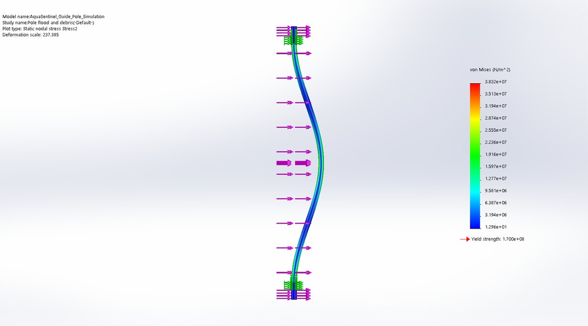<br><sub>Guide pole: von Mises stress</sub></td>
<td>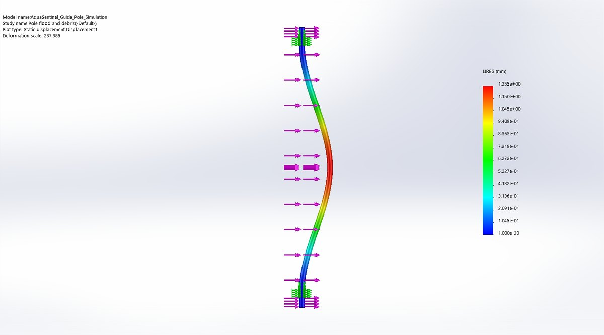<br><sub>Guide pole: displacement</sub></td>
</tr>
<tr>
<td>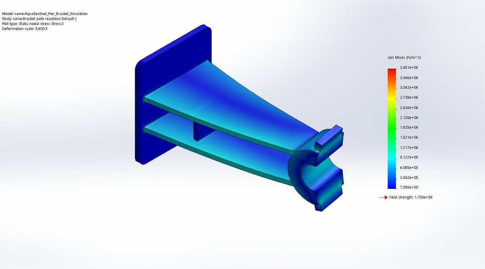<br><sub>Pier bracket: von Mises stress</sub></td>
<td>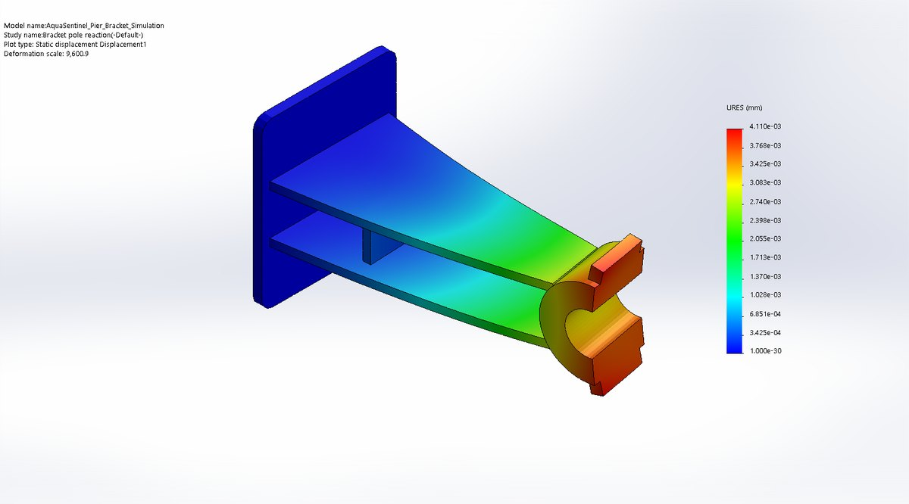<br><sub>Pier bracket: displacement</sub></td>
</tr>
</table>

Full study reports, setups and the simulation parts are in [`mechanical/simulation/`](mechanical/simulation).

## 🔌 Electronics and firmware

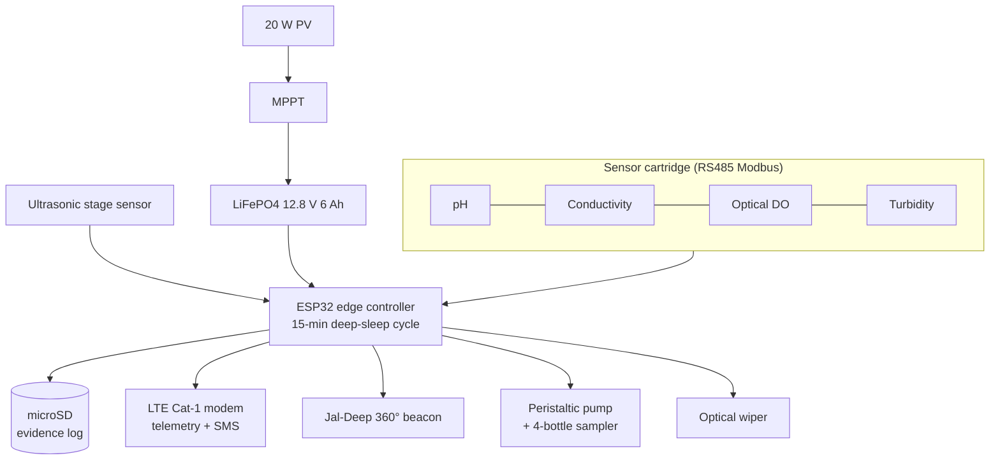
```mermaid
flowchart TB
    subgraph Probes["Sensor cartridge (RS485 Modbus)"]
        PH[pH] --- EC[Conductivity] --- DO[Optical DO] --- TU[Turbidity]
    end
    LV[Ultrasonic stage sensor] --> MCU
    Probes --> MCU["ESP32 edge controller<br/>15-min deep-sleep cycle"]
    MCU --> SD[(microSD<br/>evidence log)]
    MCU --> LTE[LTE Cat-1 modem<br/>telemetry + SMS]
    MCU --> BEA[Jal-Deep 360° beacon]
    MCU --> PUMP[Peristaltic pump<br/>+ 4-bottle sampler]
    MCU --> WIP[Optical wiper]
    PV[20 W PV] --> MPPT[MPPT] --> BAT[LiFePO4 12.8 V 6 Ah] --> MCU
```

The firmware in [`firmware/edge_node`](firmware/edge_node) (PlatformIO, Arduino framework) is organised as one module per job:

| Module | Job |
|---|---|
| `sensor_interface` | power-gated RS485 Modbus reads of the four probes + stage |
| `dsp_filters` | exponential smoothing of each probe before any decision |
| `anomaly_engine` | the decision: CPCB Class C hard limits + robust z-score against a 24-bin diurnal baseline |
| `autosampler` | 20 s purge to waste, 30 s fill, carousel indexing; bottle state survives deep sleep |
| `wiper_actuator` | anti-fouling sweeps of the optical faces |
| `microsd_logger` · `telemetry_comm` | time-stamped evidence log; JSON telemetry frame handed to the LTE modem (AT-command driver still to be written) |

Electronics: [KiCad schematic](hardware/kicad), [power budget](hardware/power_budget.csv) (≈ 3.4 Wh/day estimated load),
[cost BOM](hardware/AquaSentinel_Cost_Estimate_BOM.csv) and a [bench energy test procedure](hardware/bench_energy_test_procedure.md).

## 🧠 Detection logic

Two tracks run on every reading:

1. **Hard limits act immediately.** Any reading outside CPCB Class C (pH 6.0–9.0, DO ≥ 4 mg/L, EC ≤ 2250 µS/cm) is an alert.
2. **Learned baseline.** For the first 7 days the float learns what normal looks like at that site, hour by hour (pH, DO and
   temperature swing with the sun). After that, a reading is unusual when its robust z-score passes the threshold, and it
   acts when **2 of the last 3** readings are unusual, so a single splash or bubble can't trigger a sample.

<p align="center">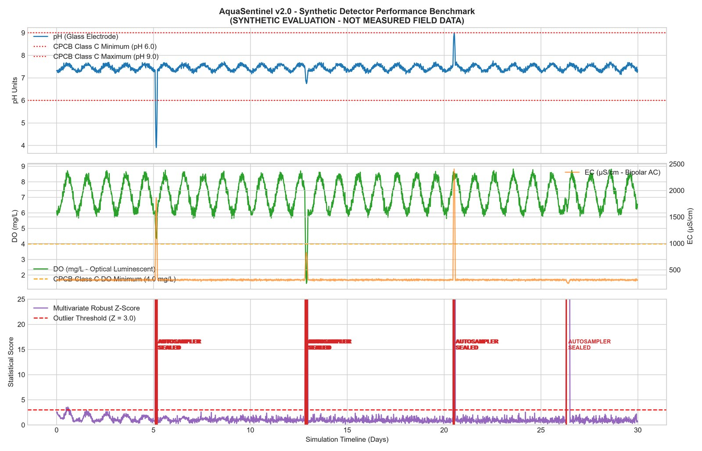<br>
<sub>The decision logic replayed on 30 days of synthetic river data with four injected spills: all four flagged, each within 30 minutes. Synthetic benchmark, not field data.</sub></p>

The Python reference ([`analytics/detector.py`](analytics/detector.py)) mirrors the firmware decision step;
[`analytics/evaluate.py`](analytics/evaluate.py) replays it over the [synthetic dataset](analytics/dataset), and
[`advection_dispersion_model.py`](analytics/advection_dispersion_model.py) estimates how long a plume takes to reach downstream intakes.

## 📊 Dashboard

<p align="center"><a href="https://soham0777.github.io/AquaSentinel/dashboard/">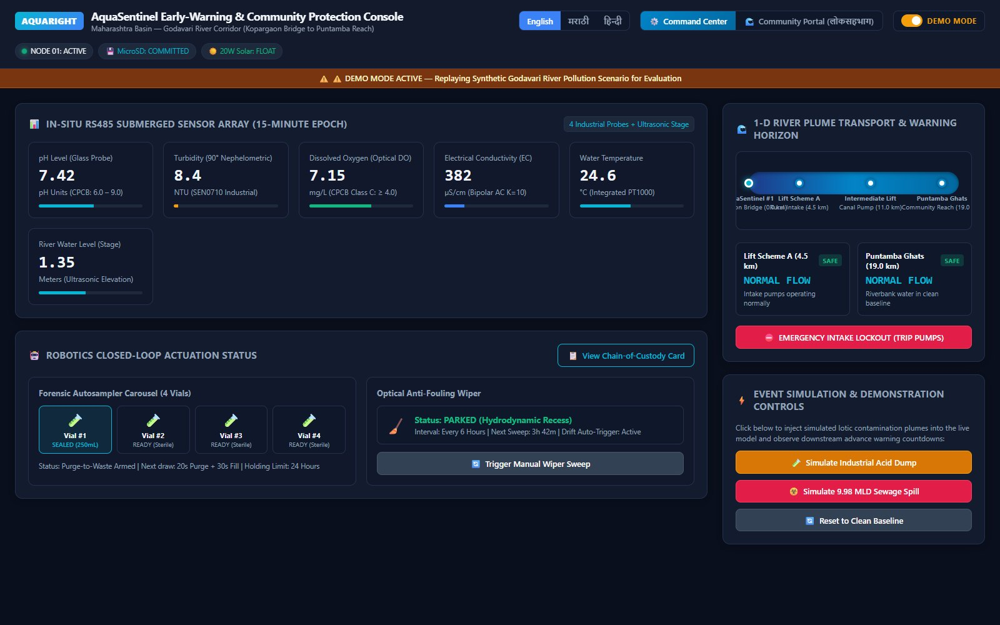</a></p>

A web console for the water-works and pollution board, in **English, मराठी and हिंदी**: live probe tiles, the downstream
plume horizon from the float to the Puntamba ghats, the sampler carousel and chain-of-custody card. It runs in **demo mode**,
replaying a synthetic Godavari pollution scenario. **[Open the demo →](https://soham0777.github.io/AquaSentinel/dashboard/)**

## 🧊 CAD, drawings and the 3D model

<p align="center"><a href="https://soham0777.github.io/AquaSentinel/viewer.html">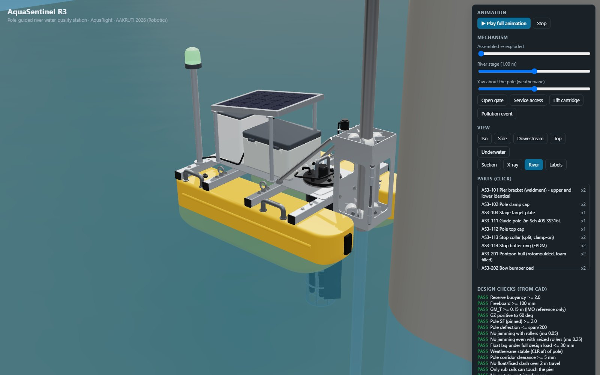</a><br>
<sub><b><a href="https://soham0777.github.io/AquaSentinel/viewer.html">Open the interactive 3D model</a></b>: change the river level, open the gate, lift the cartridge, trigger a pollution event, explode the assembly, click any part.</sub></p>

| What | Where |
|---|---|
| **SOLIDWORKS assembly + all part files** (Pack and Go) | [`mechanical/solidworks/AquaSentinel_R3_SOLIDWORKS_PackAndGo.zip`](mechanical/solidworks) |
| Neutral CAD: assembly STEP, GLB scene, one STEP + STL per part | [`mechanical/cad/`](mechanical/cad) |
| Bill of materials linked to part numbers | [`mechanical/cad/BOM_R3.csv`](mechanical/cad/BOM_R3.csv) |
| Drawing set, 6 × A3 | [`mechanical/drawings/AquaSentinel_R3_Drawing_Set.pdf`](mechanical/drawings/AquaSentinel_R3_Drawing_Set.pdf) |
| Design check sheet | [`mechanical/checks/`](mechanical/checks) |
| Parametric source: every dimension in one file | [`mechanical/src/params.py`](mechanical/src/params.py) |

<p align="center">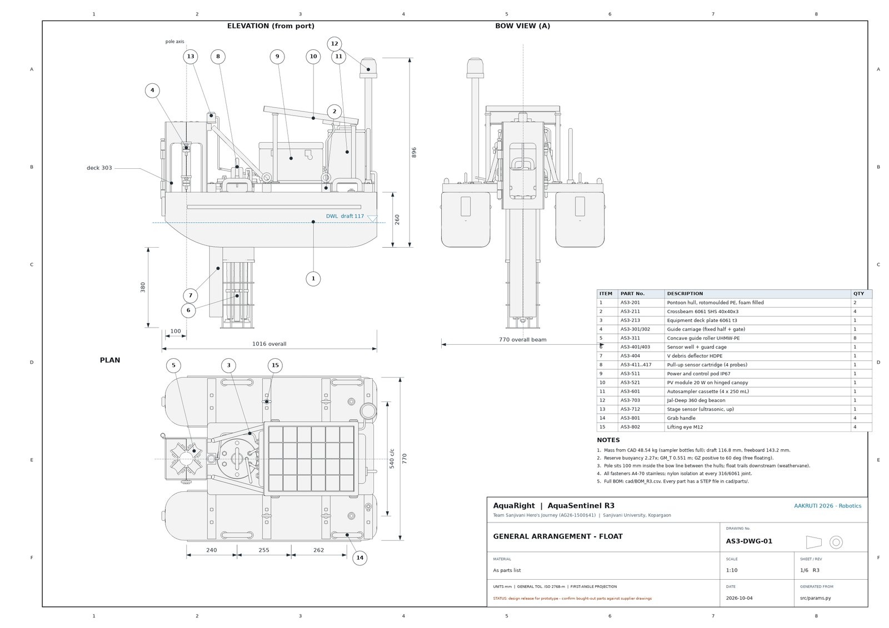</p>

## 🎬 Videos

<table>
<tr>
<td width="33%" align="center"><a href="https://soham0777.github.io/AquaSentinel/#videos">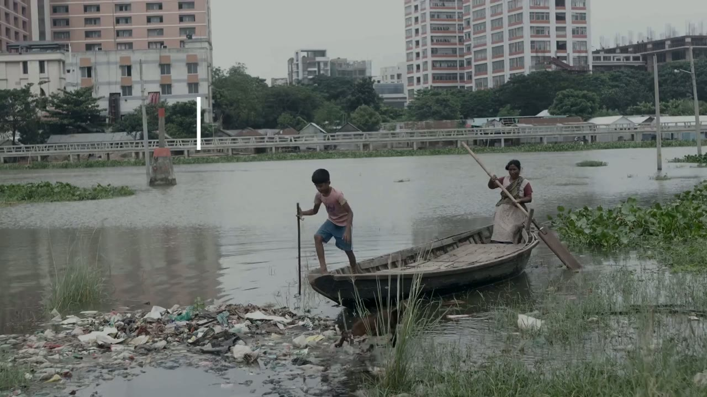</a><br><b>Pitch</b> · 1:50<br><sub>The problem, the solution and its impact</sub></td>
<td width="33%" align="center"><a href="https://soham0777.github.io/AquaSentinel/#videos">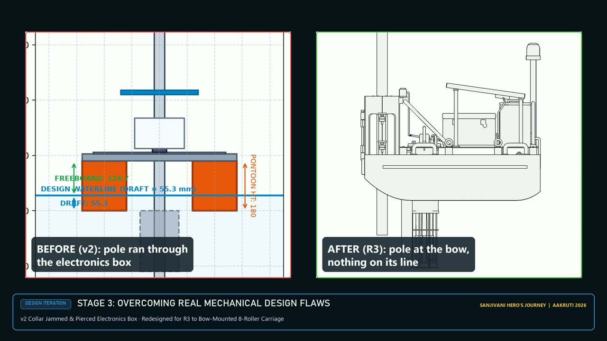</a><br><b>Our journey</b> · 1:58<br><sub>The team, the brainstorming, the design iterations</sub></td>
<td width="33%" align="center"><a href="https://soham0777.github.io/AquaSentinel/#videos">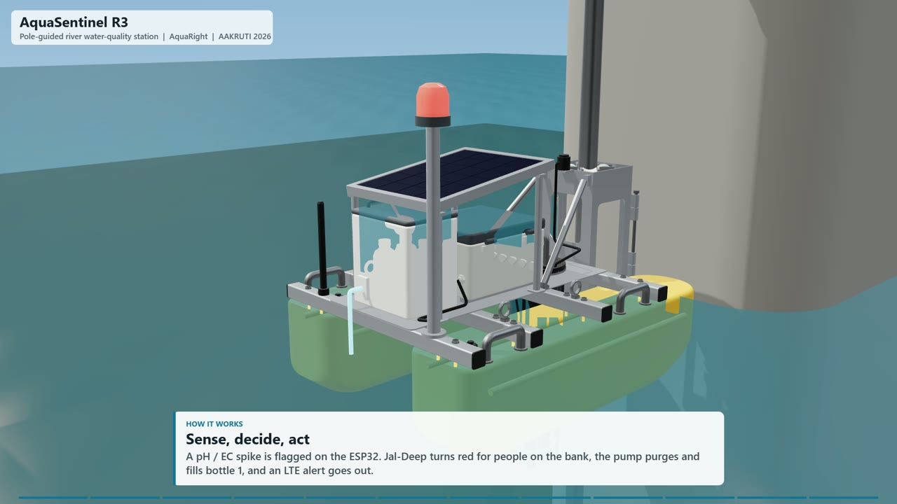</a><br><b>Assembly & operation</b> · 1:47<br><sub>Every part in place, then a day on the river</sub></td>
</tr>
</table>

Watch them on the [project site](https://soham0777.github.io/AquaSentinel/#videos); full-quality 1080p files are attached to the
[latest release](https://github.com/soham0777/AquaSentinel/releases/latest).

## 📑 The presentation

<p align="center"><a href="docs/presentation/AquaSentinel_FDC_AAKRUTI_2026.pdf">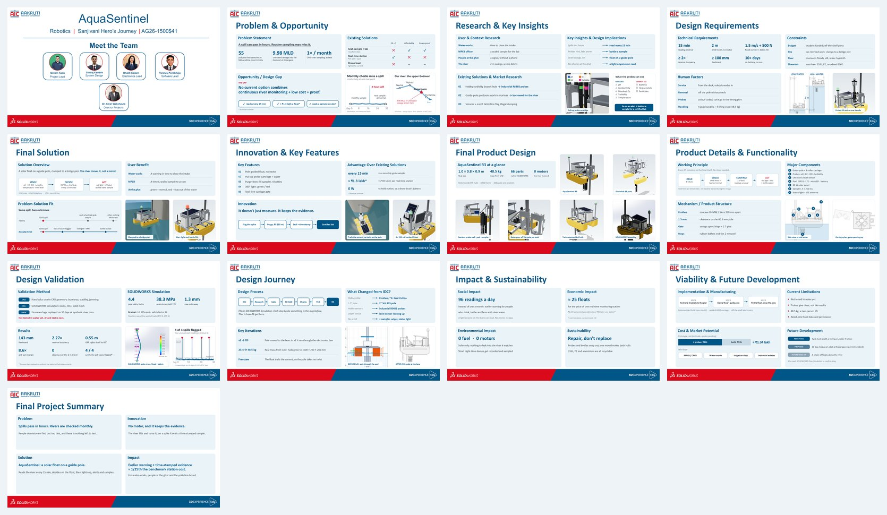</a><br>
<sub>The 13-slide Final Design Concept deck on the official AAKRUTI template. <a href="docs/presentation/AquaSentinel_FDC_AAKRUTI_2026.pdf">PDF</a> · PowerPoint in the <a href="https://github.com/soham0777/AquaSentinel/releases/latest">release</a></sub></p>

## 🧭 The design journey

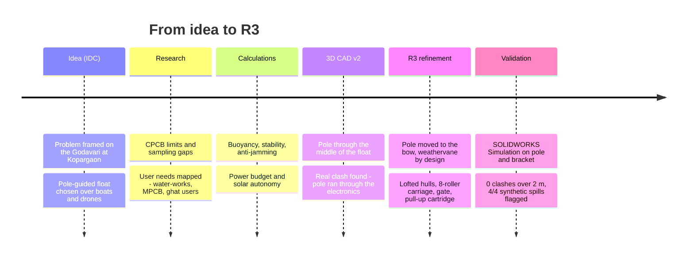
```mermaid
timeline
    title From idea to R3
    Idea (IDC) : Problem framed on the Godavari at Kopargaon : Pole-guided float chosen over boats and drones
    Research   : CPCB limits and sampling gaps : User needs mapped - water-works, MPCB, ghat users
    Calculations : Buoyancy, stability, anti-jamming : Power budget and solar autonomy
    3D CAD v2  : Pole through the middle of the float : Real clash found - pole ran through the electronics
    R3 refinement : Pole moved to the bow, weathervane by design : Lofted hulls, 8-roller carriage, gate, pull-up cartridge
    Validation : SOLIDWORKS Simulation on pole and bracket : 0 clashes over 2 m, 4/4 synthetic spills flagged
```

The project was planned in **ENOVIA Project Planning** on the 3DEXPERIENCE platform:

<p align="center">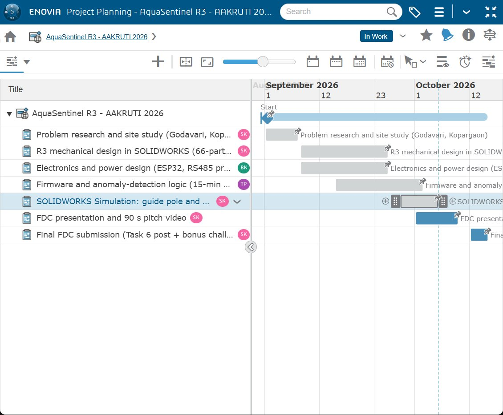</p>

## 🗂️ Repository map

```text
AquaSentinel/
├── mechanical/                 R3 mechanical design
│   ├── src/                    parametric design engine (params, geometry kernel, parts, analysis, exporters, drawings)
│   ├── cad/                    STEP + STL per part, assembly STEP, GLB scene, BOM
│   ├── solidworks/             SOLIDWORKS Pack and Go: assembly + all part files
│   ├── simulation/             SOLIDWORKS Simulation studies, plots, reports
│   ├── drawings/               6 × A3 drawing set (PNG + PDF)
│   ├── checks/                 design checks (JSON) + check sheet
│   ├── viewer/ · tools/        3D viewer source, local server, STEP validation page
├── firmware/edge_node/         ESP32 firmware (PlatformIO)
├── analytics/                  detection engine reference, evaluation, synthetic dataset, plume model
├── hardware/                   KiCad schematic, cost BOM, power budget, bench test procedure
├── docs/                       project site (GitHub Pages)
│   ├── viewer.html             interactive 3D model
│   ├── dashboard/              command dashboard demo
│   ├── presentation/           Final Design Concept deck (PDF)
│   ├── engineering/            claims register, jury Q&A, robotics subsystems spec, SOLIDWORKS build guide
│   └── media/ · assets/        web videos and images
└── project-management/         ENOVIA project plan
```

## 🚀 Run it yourself

```bash
# Replay the detection engine on the synthetic river dataset (Python 3 + numpy, matplotlib)
cd analytics && python evaluate.py
```

```bash
# Rebuild the whole mechanical design: geometry, checks, STEP/STL/GLB, BOM (Python 3 + numpy, matplotlib, Pillow)
cd mechanical && python src/build.py
```

```bash
# Build the firmware (PlatformIO; not yet compiled and run on the real hardware)
cd firmware/edge_node && pio run
```

Or just open [`docs/viewer.html`](docs/viewer.html) and [`docs/dashboard/index.html`](docs/dashboard/index.html) in a browser
(the viewer loads three.js from a CDN). To open the CAD, unzip the Pack and Go file and open `AquaSentinel_R3_Assembly.SLDASM` in SOLIDWORKS.

## ✅ Honest status

| Done | Next |
|---|---|
| Complete R3 design in CAD, 66 parts, drawings, BOM | Tank test: draft, 2 m travel, roller friction |
| SOLIDWORKS Simulation of the pole and pier bracket | Weigh the real components, update the mass budget |
| Hydrostatics, stability, anti-jamming and clash checks | 30-day Godavari pilot at Kopargaon (permits needed) |
| Firmware architecture and decision logic | Bench-run the firmware on the real probes |
| Decision logic replayed on synthetic data (4/4 spills flagged) | Validate on field data with a certified lab |
| Dashboard demo in three languages | Dated supplier quotes for the cost estimate |

Probes give clues, not lab results: the float flags a likely spill and seals the evidence, and a certified lab confirms it.

## 👥 Team

<table>
<tr>
<td align="center"><b>Soham Kadu</b><br><sub>Project Lead</sub></td>
<td align="center"><b>Shriraj Kamble</b><br><sub>System Design</sub></td>
<td align="center"><b>Bhakti Kadam</b><br><sub>Electronics Lead</sub></td>
<td align="center"><b>Tanmay Pendbhaje</b><br><sub>Software Lead</sub></td>
<td align="center"><b>Dr. Kiran Wakchaure</b><br><sub>Mentor · Director Projects</sub></td>
</tr>
</table>

<p align="center"><b>Team Sanjivani Hero's Journey</b> · Team ID AG26-1500$41 · Sanjivani University, Kopargaon, Maharashtra</p>

## 🏆 The competition

The AAKRUTI Innovation Competition 2026 is run with **Dassault Systèmes** on the **3DEXPERIENCE** platform.
This project is our **Final Design Concept (FDC)** entry in the **Robotics** theme. The design was built in
**SOLIDWORKS**, validated with **SOLIDWORKS Simulation** and planned in **ENOVIA**.

## 📄 License

Code (design engine, firmware, analytics, dashboard, viewer) is released under the [MIT License](LICENSE).
The presentation, videos, renders and drawings are © 2026 Team Sanjivani Hero's Journey; please ask before reusing them.

<div align="center"><br><sub>Made on the banks of the Godavari 🌊</sub></div>
